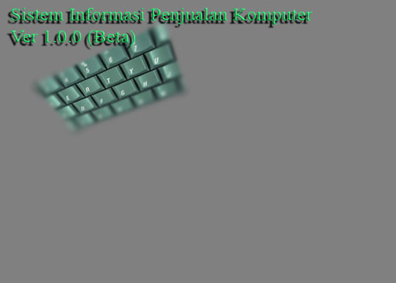



## Sistem Informasi Penjualan Komputer \(POS\)

### Description

Aplikasi dasar penjualan menggunakan database access, aplikasi ini menangani penjualan komputer sistem kredit.
 
### More Info
 
SQL, Database (khususnya menggunakan database Access)

             |
---                |---
**Submitted On**   |2009-08-10 04:54:42
**By**             |[Miftahul](https://github.com/Planet-Source-Code/PSCIndex/blob/master/ByAuthor/miftahul.md)
**Level**          |Intermediate
**User Rating**    |4.0 (8 globes from 2 users)
**Compatibility**  |VB 6\.0
**Category**       |[Databases/ Data Access/ DAO/ ADO](https://github.com/Planet-Source-Code/PSCIndex/blob/master/ByCategory/databases-data-access-dao-ado__1-6.md)
**World**          |[Visual Basic](https://github.com/Planet-Source-Code/PSCIndex/blob/master/ByWorld/visual-basic.md)
**Archive File**   |[Sistem\_Inf2159678102009\.zip](https://github.com/Planet-Source-Code/miftahul-sistem-informasi-penjualan-komputer-pos__1-72346/archive/master.zip)

